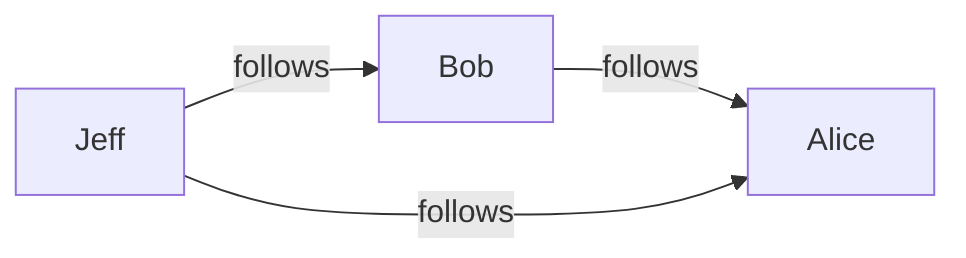
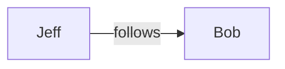
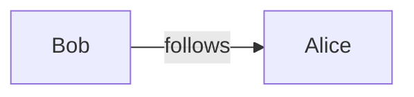
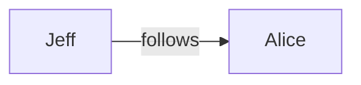
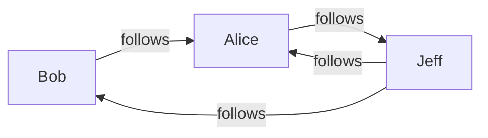
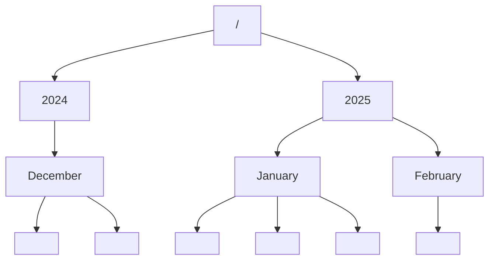
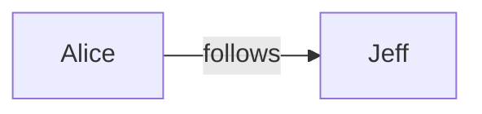

Knowledge graphs are the basis for data integration, power search engines and are the best fit to train AI models upon.
They are designed to be published on the web (public or private), so consumers can easily access and query these
knowledge graphs.
Knowledge graphs are typically constructed from various data sources spread across organisations, departments,
governments, the web...

Let's introduce a simple example. Consider this table, representing who follows who on a social network:

| Person | Follows |
|--------|---------|
| Bob    | Alice   |
| Jeff   | Bob     |
| Jeff   | Alice   |

This can be represented by the following knowledge graph:



This graph can be broken down in simple statements describing objects and their relations, called *triples*. The example
consists of the following triples:





## Generating a Knowledge Graph

Various specifications and software tools exist to build knowledge graphs.
A widely adopted specification is the RDF Mapping Language ([RML](https://rml.io/specs/rml/), [website](https://rml.io)) 
which uses a declarative approach.
One can describe how sources can be accessed and how data records can be extracted.
Next, rules describe how these records can be turned into triples.
Finally, there are rules describing where the generated graph can be written to. This is called a target.

In RML the rules to convert the table to the knowledge graph look like:

```turtle
@prefix ex: <http://example.com/> .
@prefix rml: <http://w3id.org/rml/> .

<http://example.com/base/TriplesMap1> a rml:TriplesMap;

  rml:logicalSource [ a rml:LogicalSource;
      rml:referenceFormulation rml:CSV;
      rml:source [ a rml:RelativePathSource;
          rml:root rml:MappingDirectory;
          rml:path "data.csv"
        ]
    ];

  rml:subjectMap [
      rml:template "http://example.com/{Person}"
    ] ;

  rml:predicateObjectMap [
      rml:predicate ex:follows
      rml:objectMap [
          rml:template "http://example.com/{Follows}"
        ];
   ].
```
Let's not dive into detail too much, but what this mapping does is:
- The `@prefix` statements map an abbreviation to a IRI.
- The `rml:logicalSource` part sais that the data comes from a file called `data.csv` (the table of the example)
- The `rml:subjectMap` assigns a unique IRI to a Person; this is required for knowledge graphs represented in
  [RDF](https://www.w3.org/TR/rdf-primer/)
- The `rml:predicateObjectMap` makes a connection to another person in the `Follows` column, and assigns a label or
  property `ex:follows` to the connection indicating the type of relation.

Because this is a bit verbose, another language [YARRRML](https://rml.io/yarrrml/spec/) was designed to make such 
mapping rules a bit more intuitive. The same result could be achieved with the following rules in YARRRML:

```yaml
prefixes:
  ex: http://example.com/

mappings:
  followers:
    sources: [data.csv~csv]
    subject: http://example.com/$(Person)
    predicateobjects:
      - [ex:follows, http://example.com/$(Person)]
```
A YARRRML processor takes these rules and generates the corresponding RML rules.

## All about change: LDES

Now that we know how to generate a Knowledge Graph, let's add a challenge. After a while Alice starts to follow Jeff.
The knowledge graph now looks like this:



A possible approach would be to just rebuild the whole knowledge
graph. No need to change the mapping rules.
And suppose we published this graph, we would have to notify the consumers that the graph changed. They would have to
download the whole graph to have the latest changes. This works well for small graphs, but is not very scalable.

Enter Linked Data Event Streams ([LDES](https://w3id.org/ldes/specification)), a mechanism to publish changing
knowledge graphs on the web.
In short, LDES can be described as a collection of immutable data. 
New versions of the data can be added to the collection, forming a stream of updates.
This allows consumers of the data to keep up-to-date with minimal effort. 

Furthermore, LDES allows *fragmentation* of the data making search more efficient by providing a
search tree view. Fragments that are unlikely to change can be  cached, e.g. using HTTP caching.



This figure illustrates a LDES.
The blocks at the bottom represent data objects (called *members*).
In this case time-based hierarchical fragmentation is used.
The fragments representing a month point to its members.
Fragments can be linked (using the [TREE](https://w3id.org/tree/specification) hypermedia controls).

## Generating a *changing* Knowledge Graph

So now we have the tools to generate a knowledge graph, and we know how to publish a knowledge graph that changes.
But if the data changes, how to generate the changes *only* without rebuilding the whole graph?

[IncRML](https://www.semantic-web-journal.net/content/incrml-incremental-knowledge-graph-construction-heterogeneous-data-sources)
describes how this can be achieved using RML.
It introduces some functions that can, during the mapping process, detect changes in the data.
One can specify when a change in the data triggers the generation of new triples (thus updates of the knowledge graph).
Three types of changes are defined: *create*, *update* and *delete*.
As a bonus, a target is added that can write the changes as a LDES.
It requires a certain effort to get it right: every type of change (for the same data) needs a new set of rules, with
the appropriate function arguments configured.

To lower this effort, we recently introduced a [YARRRML extension](https://rml.io/yarrrml/spec/incrml/) that lowers
the complexity by generating the appropriate RML mappings and functions.

Back to the example. We started with a csv file having three rows:

| Person | Follows |
|--------|---------|
| Bob    | Alice   |
| Jeff   | Bob     |
| Jeff   | Alice   |

Alice decides to follow Jeff, so the file gets updated:

| Person | Follows |
|--------|---------|
| Bob    | Alice   |
| Jeff   | Bob     |
| Jeff   | Alice   |
| Alice  | Jeff    |

We somehow know that the data source is updated, but we are not notified about *what* exactly changed.
The only way to know is to read the file again, then we see a new record is created.
This is called an *implicit* change.

Another possibility is that only the changes are advertised, which is called *explicit* changes.
For example, a Kafka topic could stream only updates in JSON format:

```json
{
  "change": "create",
  "Person": "Alice",
  "Follows": "Jeff"
}
```

But let's take the implicit change as an example. We can specify this in our YARRRML mappings like this:
```yaml
prefixes:
  ex: http://example.com/

mappings:
  followers:
    sources: [data.csv~csv]
    subject: http://example.com/$(Person)
    predicateobjects:
      - [ex:follows, http://example.com/$(Person)]
    changeDetection:
      create:
        explicit: false
```
When the first version of the data is mapped to a knowledge graph, the three triples displayed at the top
of this post are generated. When the second version is mapped, only one triple gets generated:


If we add an LDES target, everything will be mapped as a stream of changes:
```yaml
prefixes:
  ex: http://example.com/

mappings:
  followers:
    sources: [data.csv~csv]
    subject: 
      - value: http://example.com/$(Person)
        targets:
          access: out-ldes.ttl
          type: localfile
          serialization: turtle
          ldes:
            id: https://my-ldes.org/social-network-ldes
    predicateobjects:
      - [ex:follows, http://example.com/$(Person)]
    changeDetection:
      create:
        explicit: false
```
When mapping the first version of the data with an LDES target, the knowledge graph looks like:

```turtle
:Bob :follows :Alice .
:Jeff :follows :Bob,
               :Alice .

my-ldes:social-network-ldes
  a ldes:EventStream;
  tree:member :Bob,
              :Jeff .
```

The second run with the updated data generates following triples:

```turtle
:Alice :follows :Jeff .

my-ldes:social-network-ldes
  a ldes:EventStream;
  tree:member :Alice .
```

When merged together the complete knowledge graph is formed:

```turtle
:Bob :follows :Alice .
:Jeff :follows :Bob,
               :Alice .
:Alice :follows :Jeff .

my-ldes:social-network-ldes
  a ldes:EventStream;
  tree:member :Bob,
              :Jeff,
              :Alice .
```

This is only a simple example. A few more elaborate examples are available on
[GitHub](https://github.com/ghsnd/incrml-generation-in-yarrrml-examples).
The corresponding RML examples can be found
[here](https://github.com/RMLio/rmlmapper-java/tree/master/src/test/resources/rml-ldes).
