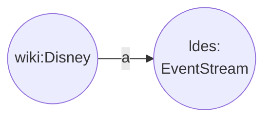
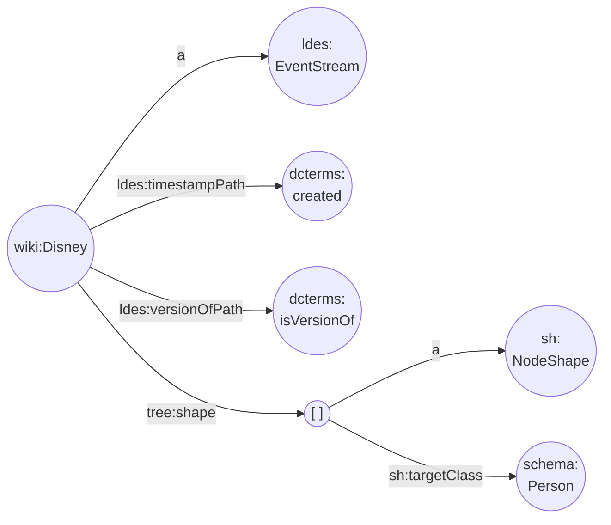

The [LDES specifications](https://semiceu.github.io/LinkedDataEventStreams/) is built on top of the [TREE specifications](https://treecg.github.io/specification), which defines some fundamental concepts on which LDES is built.

The LDES specification defines a `ldes:EventStream` to be a `tree:Collection` whose members are _immutable_. This basically means that an event stream contains things that do not change, that is, _versions_ of an object. In other words, a LDES is an append-only collection of immutable (version) objects, which represents their subsequent states, or put differently, the history of these things. 

As you can imagine, an empty LDES looks similar to an empty TREE collection, except for its type:
```
@prefix ldes: <https://w3id.org/ldes#> .
@prefix wiki: <http://en.wikipedia.org/wiki/> .
wiki:disney a ldes:EventStream .
```
**Note** that we do not double type the data set with `tree:Collection` as this is [implied](https://github.com/SEMICeu/LinkedDataEventStreams/blob/b9c0d747e8d0cb6cb2b0215c758252cf95c30cda/vocabulary.ttl#L34).


Fig 1. Example of a LDES without members.

We need a way to know which members (version objects) represent the states of the same thing. The [Dublin Core](https://www.dublincore.org/specifications/dublin-core/dcmi-terms/) vocabulary defines exactly what we need: a [`dct:isVersionOf`](https://www.dublincore.org/specifications/dublin-core/dcmi-terms/terms/isVersionOf/) predicate which defines the relation between a resource (the version) and the resource (the thing) it is a version of.

But, in order to have a history of a thing, we also need to know which version comes first and which version is a later state of that thing. So, we need a predicate that allows us to sort the versions by time. We can use the `dct:created` predicate to hold a date and time (timestamp) value for each version. Alternatively, we can use the [provenance](https://www.w3.org/ns/prov#) vocabulary and take the `prov:generatedAtTime` predicate instead.

Now, how does a data client know which property to use for grouping and sorting? To allow this, the LDES specification defines two (optional) predicates on an `ldes:EventStream`: the `ldes:versionOfPath` and the `ldes:timestampPath`. The data publisher can choose the predicates freely but usually the `dct:isVersionOf` and the `dct:created` suffice. 

**Note** that only if both are provided a data client can reconstruct the history of things in the correct order. Such an event stream we call a [_versioned_ LDES](https://semiceu.github.io/LinkedDataEventStreams/#versioning).

```
@prefix tree: <https://w3id.org/tree#> .
@prefix ldes: <https://w3id.org/ldes#> .
@prefix wiki: <http://en.wikipedia.org/wiki/> .
@prefix sh: <http://www.w3.org/ns/shacl#> .
@prefix schema: <http://schema.org/> .
@prefix dct: <http://purl.org/dc/terms/> .
wiki:disney a ldes:EventStream ;
  tree:shape [ a sh:NodeShape; sh:targetClass schema:Person ] ;
  ldes:versionOfPath dct:isVersionOf ;
  ldes:timestampPath dct:created .
```
**Note** that we also added a `tree:shape` to communicate to the data client that this event stream holds data items of type (schema) person.


Fig 2. Example of (almost) completely defined LDES.

Now, before we add members to our LDES we need to look into how we name and represent a member, which, as we already know, is a version of a thing. To machines it does not matter how such a member is named but us humans like structure so what you would typically do is take the URI of the original thing (state object) and append a version identifier to it, i.e. a timestamp value. This makes a version's identifier unique while it is still readable and even visually sortable.

For example, given a state object identified by some URI such as `http://example.org/thing/1` and given some version value such as `2000-01-01T15:00:00` we typically create a member identifier by appending a separator ('#' or similar) and the timestamp value to the URI, resulting in `http://example.org/thing/1#2000-01-01T15:00:00`.

<a name="full-example"></a>
```
@prefix tree: <https://w3id.org/tree#> .
@prefix ldes: <https://w3id.org/ldes#> .
@prefix wiki: <http://en.wikipedia.org/wiki/> .
@prefix sh: <http://www.w3.org/ns/shacl#> .
@prefix schema: <http://schema.org/> .
@prefix dct: <http://purl.org/dc/terms/> .
@prefix xsd: <http://www.w3.org/2001/XMLSchema#> .
wiki:disney a ldes:EventStream ;
  tree:shape [ a sh:NodeShape; sh:targetClass schema:Person ] ;
  ldes:versionOfPath dct:isVersionOf ;
  ldes:timestampPath dct:created ;
  tree:member
     wiki:Mickey_Mouse#v1, wiki:Minnie_Mouse#v1, 
     wiki:Minnie_Mouse#v2, wiki:Mickey_Mouse#v2 .
wiki:Mickey_Mouse#v1 a schema:Person ;
  dct:isVersionOf wiki:Mickey_Mouse ;
  dct:created "1928-01-15T00:00:00"^^xsd:dateTime ;
  schema:gender "male" ;
  schema:owns
    [ a schema:Product ; schema:category "gloves" ; schema:color "yellow" ], 
    [ a schema:Product ; schema:category "trousers" ; schema:color "red" ], 
    [ a schema:Product ; schema:category "shoes" ; schema:color "brown" ] .
wiki:Minnie_Mouse#v1 a schema:Person ;
  dct:isVersionOf wiki:Minnie_Mouse ;
  dct:created "1928-05-15T00:00:00"^^xsd:dateTime ;
  schema:gender "female" .
wiki:Minnie_Mouse#v2 a schema:Person ;
  dct:isVersionOf wiki:Minnie_Mouse ;
  dct:created "2000-01-01T00:00:00"^^xsd:dateTime ;
  schema:gender "female" ;
  schema:owns
    [ a schema:Product ; schema:category "hair ribbon" ; schema:color "red" ], 
    [ a schema:Product ; schema:category "dress" ; schema:color "red", "white" ], 
    [ a schema:Product ; schema:category "shoes" ; schema:color "yellow" ] .
wiki:Mickey_Mouse#v2 a schema:Person ;
  dct:isVersionOf wiki:Mickey_Mouse ;
  dct:created "1980-01-01T00:00:00"^^xsd:dateTime ;
  schema:gender "male" ;
  schema:owns
    [ a schema:Product ; schema:category "gloves" ; schema:color "white" ], 
    [ a schema:Product ; schema:category "trousers" ; schema:color "red" ], 
    [ a schema:Product ; schema:category "shoes" ; schema:color "yellow" ] .
```

**Note** that we have two versions of both Mickey and Minnie. The second Minnie version simply adds her garderobe while in the second Mickey version the garderobe has different colors.

A last question we need to answer is: how do we retrieve a LDES? Actually, that is super trivial: we simply use the [HTTP protocol](https://en.wikipedia.org/wiki/HTTP) to request the LDES using a standard [GET](https://en.wikipedia.org/wiki/HTTP#Request_methods) method and we provide the [MIME type](https://en.wikipedia.org/wiki/Media_type) of the serialization format we would like to receive, (e.g. `text/turtle` for Turtle).

For example, if we assume that our LDES is available at http://my-domain.org/ldes/disney we can run the following command in a terminal window:
```
curl "http://my-domain.org/ldes/disney" -X GET -H "content-type: text/turtle"
```
**Note** that you can request the LDES using any internet browser as well, but it is non-trivial to request a specific serialization. The LDES server will return it in its default RDF serialization.

An implementation of a LDES server can choose at what HTTP endpoint it offers a LDES. The LDES specification does not impose any restrictions on the actual API of a LDES server: it only defines the content of a LDES. Actually, the LDES specification only defines a generic way to retrieve a LDES using the HTTP protocol.

The [LDES vocabulary](https://raw.githubusercontent.com/SEMICeu/LinkedDataEventStreams/b9c0d747e8d0cb6cb2b0215c758252cf95c30cda/vocabulary.ttl) formally defines all the concepts in detail.

As you can see in the example above, even the human readable Turtle format is pretty verbose. This is not related to LDES specific but rather to linked data in general. In order to have unambiguous semantics we need this verbosity. But, is that not a small price to pay for great interoperability?

Summarized, the LDES specification defines that a **`ldes:EventStream` contains immutable members** and communicates to data clients **how versions of a thing can be grouped and sorted**.
