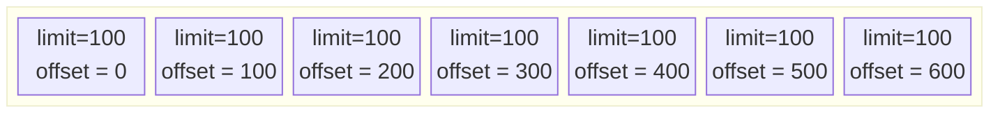
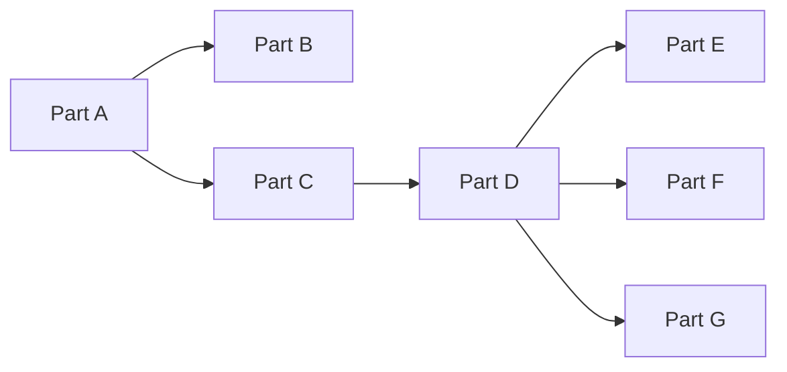
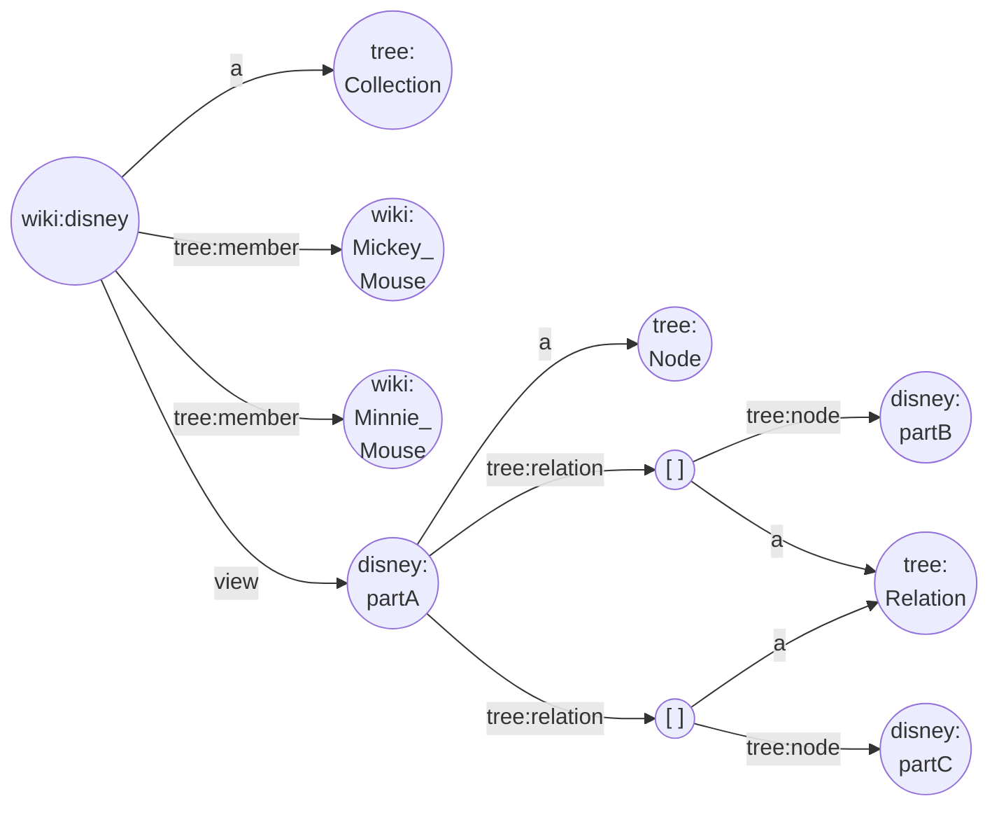
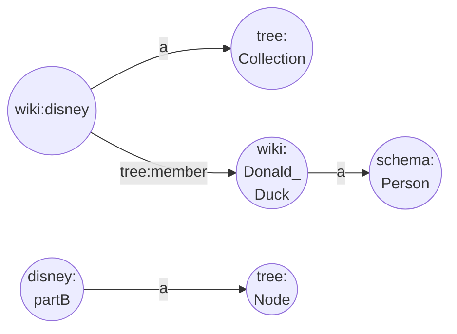
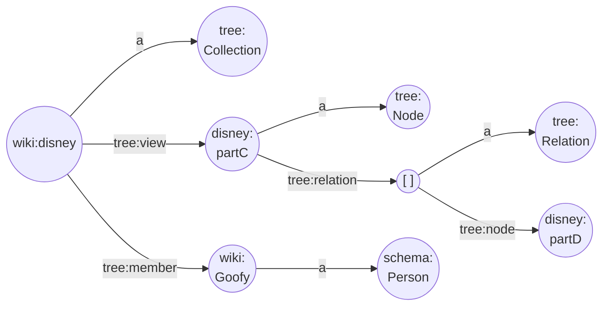

Because data sets can be large or even huge, an API allows to retrieve data items in chunks, which are equally sized subsets of a data set.

Typically, an API call allows sorting the resulting (whole or partial) data set and to pass two parameters to facilitate this _pagination_: a _limit_ (chunk/page size) and an _offset_ (chunk/page starting point). To retrieve the resulting data items without duplicates or missing data items, you need to do subsequent calls to such an API and keep the limit constant and increment the offset by the chosen limit. Basically, you need to calculate the correct starting point to get the next chunk of data items. You need to repeat this until less data items are returned than the limit. Although, this is a very flexible way to get a data set, the data publisher must monitor these requests and take measures (database indexes, etc.) to allow for a smooth experience on the data client side. This increases the cost on the data publisher's side.


Fig 10. Retrieving data set using chunks.

The TREE specification takes a different approach. In that specification, you request a starting page. The response contains a number of data items and possibly references to more pages. You request each link referring to another page, and repeat this until a response does not contain a link anymore.


Fig 1. Retrieving data set using TREE.

> **Note** that in this example we start from part A, find the links to parts B and C and follow them both. Part B does not contain any links, so there we are done, but part C has a link to part D, so we continue by following the link to D where we find a link to parts E, F and G. After we visit parts E, F and G, which are all dead ends, we are done.

The TREE approach allows us to retrieve all parts as well, but has the benefit that you obtain the _explicit link_ to the next subset of data items and you do not need to calculate it. Because a part can link to many other parts, you can create a hierarchical _tree_. This is where the TREE specification gets its name from. In addition, since a part can link to many parts, we are not restricted in retrieving the data in a linear way but we can benefit from _retrieving the data items in a parallel way_.

> **Note** that the data publisher decides on the amount of data items returned in each response. This is intentional to keep data publisher's costs better under control. In the end it also does not matter what the chunk size is, as long as you get all the data items that you need.

The TREE specification defines a `tree:Node` type (a _node_) to have a `tree:relation` predicate of type `tree:Relation` (a _relation_). A relation has a `tree:node` predicate that is a link (URL) to another node. A `tree:Collection` has a predicate `tree:view` that points to the current `tree:Node` (the part we requested), but we typically find it only on the starting `tree:Node` of a collection.

```
@prefix tree: <https://w3id.org/tree#> .
@prefix wiki: <http://en.wikipedia.org/wiki/> .
@prefix schema: <http://schema.org/> .
@prefix disney: <http://en.wikipedia.org/wiki/disney#> .
wiki:disney a tree:Collection ;
  tree:view disney:partA ;
  tree:member wiki:Mickey_Mouse, wiki:Minnie_Mouse .
disney:partA a tree:Node ;
  tree:relation [ a tree:Relation; tree:node disney:partB ] .
  tree:relation [ a tree:Relation; tree:node disney:partC ] .
wiki:Mickey_Mouse a schema:Person .
wiki:Minnie_Mouse a schema:Person .
```


Fig 2. Tree node A (starting node)

```
@prefix tree: <https://w3id.org/tree#> .
@prefix wiki: <http://en.wikipedia.org/wiki/> .
@prefix schema: <http://schema.org/> .
@prefix void: <http://rdfs.org/ns/void#> .
@prefix disney: <http://en.wikipedia.org/wiki/disney#> .
wiki:disney a tree:Collection ;
  tree:member wiki:Donald_Duck .
disney:partB a tree:Node .
wiki:Donald_Duck a schema:Person .
```


Fig 3. Tree node B

> **Note** that because the collection is missing a triple with a `tree:view` predicate, the collection and the node (part) are disconnected.

```
@prefix tree: <https://w3id.org/tree#> .
@prefix wiki: <http://en.wikipedia.org/wiki/> .
@prefix schema: <http://schema.org/> .
@prefix void: <http://rdfs.org/ns/void#> .
@prefix disney: <http://en.wikipedia.org/wiki/disney#> .
wiki:disney a tree:Collection ;
  tree:view disney:partC ;
  tree:member wiki:Goofy .
disney:partC a tree:Node ;
  tree:relation [ a tree:Relation; tree:node disney:partD ] .
wiki:Goofy a schema:Person .
```


Fig 4. Tree node C

As a collection can contain any number of views we can create different structures that allow finding the data items in different ways.

Summarized, a _node_ is **a page containing data items and relations**. A _relation_ is a **reference to a other node** possibly containing more data items. A _view_ is (typically, but not necessarily) the starting node from which all data items for a data set can be retrieved.
