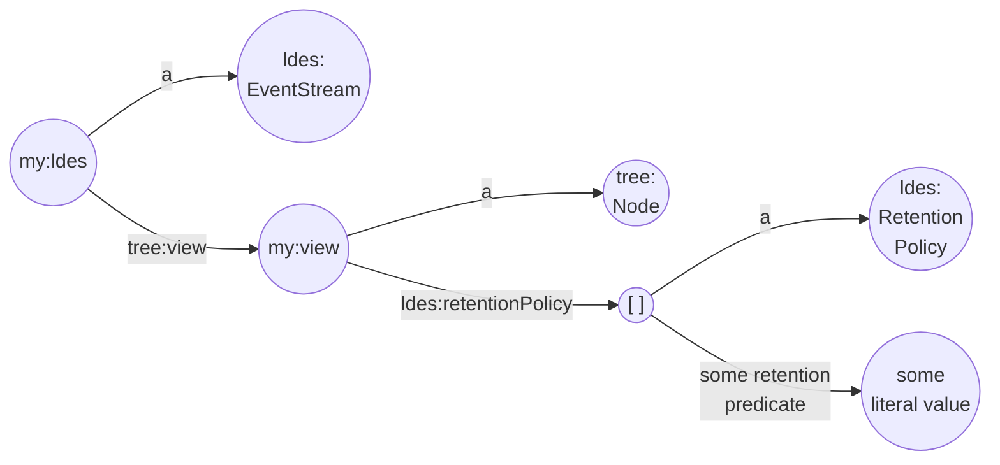

A view that contains special relations (`rdf:subClassOf tree:Relation`) allows a data client to retrieve a subset of the data set. This is great but does not solve the main problem for the data publisher: the data set can grow to an unmanageable size. This is where retention policies come to aide.

So, why is an ever growing data set a problem? Well, there is the storage cost for starters. In addition, replicating a huge data set is also costly for the data client. This brings us to a very important point: we can use retention policies to manage both what portion of the data set is available in a view and to actually remove those data items that are unavailable in all views.

By keeping a limited history of data items, a data publisher can manage the storage costs. A data client can use the retention policy definition to archive the members for which the retention policy will expire and therefore may be unavailable in the future. View retention basically means that any member is only available in a view for a limited amount of time.

The LDES specification defines a predicate `ldes:retentionPolicy` on a root node (a `tree:Node` that is the object of the `tree:view` relation), which must refer to an instance of a (specialized type of) `ldes:RetentionPolicy`. In fact, `ldes:RetentionPolicy` is just an abstract concept and therefore the LDES specification defines three concrete types of retention policies, which you can use on their own or you can combine these policies to implement more complex requirements.

Fig 1. LDES Retention Policy

> **Note** that all data items must be kept indefinitely unless a retention policy is put on _all_ views of a collection. In this case a data item can only be removed from actual storage if no retention policy applies to it.
 
Summarized, we can use **retention policies** to **manage the members that are available in a view** and **keep the storage cost under control** by actually removing members from a data set for which no retention policy applies.
