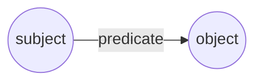
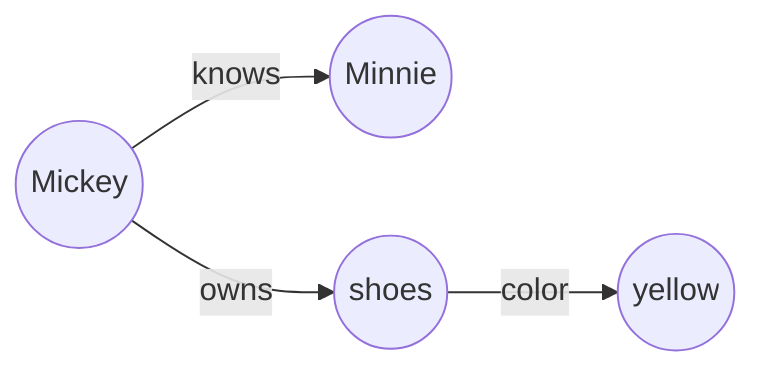
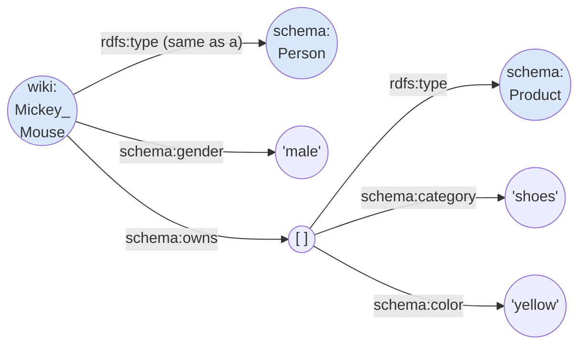
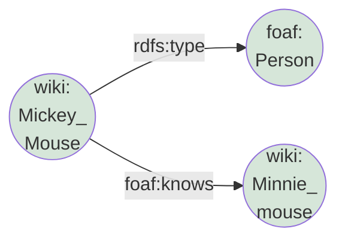
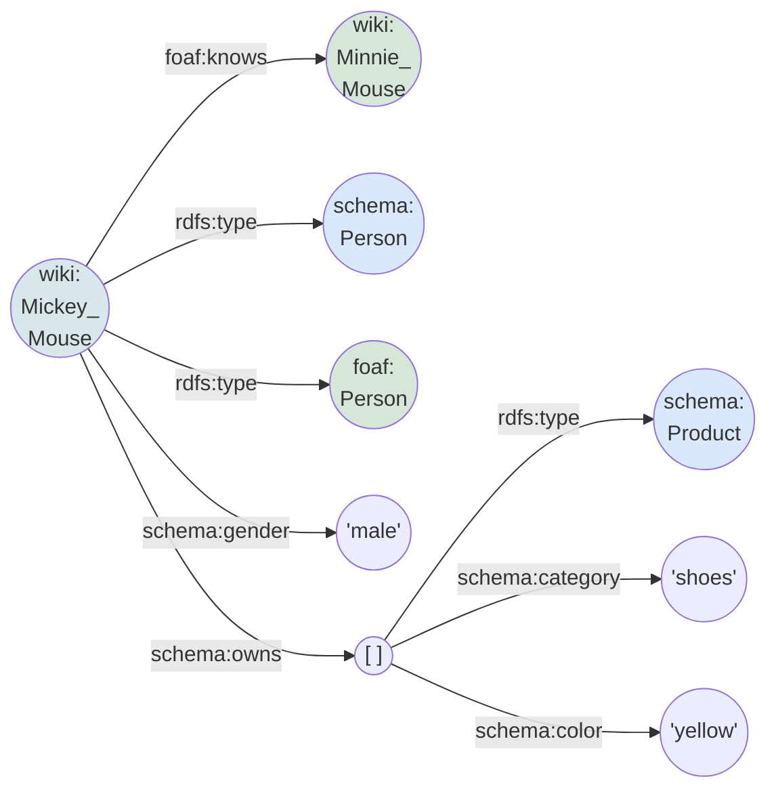

Linked data can be used to represent any structured data. In Linked Data, we use the [Resource Description Format](https://en.wikipedia.org/wiki/Resource_Description_Framework) (RDF) to model a thing (aka. resource) as a number of triples, where a triple is defined as:
* the _subject_, which is the identity of the thing,
* the _predicate_, which is the property or behavioral aspect of the thing, and
* the _object_, which is a _literal_ value (e.g. string, number, date, ...) or a _reference_ to another thing.

In fact, we can see a triple as describing the relation between the subject and the object. If we represent both the subject and the object as a _(RDF) node_, then the predicate is a link between them defining the named and unidirectional relation. When we represent one or more things this way, we end up with a [directed graph](https://en.wikipedia.org/wiki/Directed_graph). That is why we refer to a RDF model as a _(RDF) graph_.


Fig 1. RDF triple - conceptual representation.

Let us look at an example to let it sink in and to make a few important points. A phrase such as "Mickey knows Minnie" can be seen as a relation between the subject (Mickey) and the object (Minnie) where the predicate (knows) defines the nature of the (behavioral) aspect. If we add another fact (from another data set): "Mickey owns yellow shoes", we can represent it as follows:
 

Fig 2. Basic RDF example

**Note** that we need to represent the second fact as two triples because the color is a property of the shoes and not of Mickey.

**Note** that Mickey and Minnie are (fictional) characters that we can identify. But, Mickey's shoes clearly do not have their own identity: we can only refer to them as being part of Mickey's garderobe. If we would take another pair of the exact same shoes and shuffle them around, we would have no way of telling them apart.
 
Remember the two facts came from two different data sets? How can we be sure that we are referring to the same Mickey? Are we even sure they refer to Mickey Mouse and Minnie Mouse? I can imagine that Mickey Rooney (an actor) knew Minnie Riperton (a singer). Clearly, we need a way to make sure that we know exactly what the identify of the thing is.

Linked data requires all things that are identifiable to have at least one _globally unique identifier_. The recommendation is to use a [Uniform Resource Identifier (URI)](https://en.wikipedia.org/wiki/Uniform_Resource_Identifier) based on [HTTP](https://en.wikipedia.org/wiki/HTTP). Preferably, the identifier is also a [Uniform Resource Locator (URL)](https://en.wikipedia.org/wiki/URL), which allows lookup of (human and/or machine-readable) context information about the thing it identifies. If a (subject or object) node is uniquely identifiable globally, we call it a _named node_.

Now, what about the shoes? As said, there is no globally unique identifier for Mickey's shoes but we can and should make a distinction between his shoes and his trousers because these things have different properties (e.g. shoe sizes take different numbers than clothing sizes).

Linked data uses a _locally unique identifier_, a so-called _blank node_, to distinguish things without an actual identity within a single graph.

In addition, RDF has a concept called a _named graph_ that defines a sub-context. By adding such a (named) graph to the concept of a triple, we get a so-called _quad_, which is in essence a subject - predicate - object - graph combination, allowing us to group related triples in arbitrary sub-contexts.

Linked data is all about semantics, which means that the meaning of a relation (predicate) needs to be unambiguous and unique. To ensure this uniqueness, we represent a predicate with a URI based on HTTP. To achieve unambiguous meaning, the linked data community strives to agree and standardize each collection of concepts and their properties per domain and describes those in a so called (controlled) [vocabulary](https://en.wikipedia.org/wiki/Controlled_vocabulary#Applications) (which contains a glossary of terms and the IRIs that represent them), or even more formally in an [ontology](https://en.wikipedia.org/wiki/Ontology_(information_science)) (which also includes the relations between concepts, constraints and restrictions, links to other ontologies, etc.). By reusing vocabularies and adhering to ontologies, data sets can be better interlinked as the meaning of things (semantics) is aligned within those data sets. This allows for more complex querying and even deriving new facts from existing ones.

RDF can be exchanged as different file formats ([serializations](https://en.wikipedia.org/wiki/Resource_Description_Framework#Serialization_formats)). Some of them are better suited for humans to read and write, while other serializations are targeting machines. Some of them are outdated while others add features that allow representing concepts added to newer versions of the [RDF specification](https://www.w3.org/RDF/). The main formats that can only represent triples are: [Turtle](https://en.wikipedia.org/wiki/Turtle_(syntax)), [N-Triples](https://en.wikipedia.org/wiki/N-Triples) and [Notation3 (N3)](https://en.wikipedia.org/wiki/Notation3). If we need to represent quads, we can mainly use: [TriG](https://en.wikipedia.org/wiki/TriG_(syntax)), [N-Quads](https://en.wikipedia.org/wiki/N-Quads) and [JSON-LD](https://en.wikipedia.org/wiki/JSON-LD).

To understand the power (and elegance) of linked data, we will use a more elaborate example. Suppose we have a data set that describes fictional cartoon characters using the standard [schema](https://schema.org/) vocabulary. In addition, suppose we have another data set which describes relations between people using another standard vocabulary: [friend-of-a-friend](http://xmlns.com/foaf/spec/).

If the first data set contains a definition of Mickey as follows:
```
@prefix schema: <http://schema.org/> .
@prefix wiki: <http://en.wikipedia.org/wiki/> .

wiki:Mickey_Mouse 
    a schema:Person ;
    schema:gender "male" ;
    schema:owns [ a schema:Product ; schema:category "shoes" ; schema:color "yellow" ] .
```
**Note** that in the Turtle serialization:
* we need to write URIs as `<...>`, e.g. `<http://schema.org/gender>`,
* we write strings as `"..."`, e.g. `"shoes"`,
* we can use `@prefix` to shorten URIs, e.g. instead of `<http://schema.org/gender>` we can write `schema:gender`,
* we use a `;` to refer to the same subject, this is similar as shortening `Mickey is a person. Mickey is male.`  to `Mickey is a person and a male.`, and
* we represent a blank node using square brackets (`[...]`).


Fig 3. Definition of Mickey Mouse

and the second data sets contains its relation with Minnie as follows:
```
@prefix foaf: <http://xmlns.com/foaf/0.1/> .
@prefix wiki: <http://en.wikipedia.org/wiki/> .

wiki:Mickey_Mouse a foaf:Person ; foaf:knows wiki:Minnie_Mouse  .
```


Fig 4. Relations of Mickey Mouse

We can link those data sets and obtain the following data for Mickey:
```
@prefix schema: <http://schema.org/> .
@prefix foaf: <http://xmlns.com/foaf/0.1/> .
@prefix wiki: <http://en.wikipedia.org/wiki/> .

wiki:Mickey_Mouse 
    a schema:Person, foaf:Person ;
    schema:gender "male" ;
    schema:owns [ a schema:Product ; schema:category "shoes" ; schema:color "yellow" ] ;
    foaf:knows wiki:Minnie_Mouse .
```
**Note** that in Turtle we can use a `,` to refer to the same subject and predicate, similar to shortening `Mickey is a schema person. Mickey is a friend-of-a-friend person.` to `Mickey is a schema person and a friend-of-a-friend person`, where we leave out both the subject and the verb.


Fig 5. Definition and relations of Mickey Mouse combined

**Note** that in the definition of Mickey we use the URI linking to its [description on Wikipedia](http://en.wikipedia.org/wiki/Mickey_Mouse) as its (globally) unique identifier (`wiki:Mickey_Mouse` is just a shorthand notation for <http://en.wikipedia.org/wiki/Mickey_Mouse>). Obviously, we need to use the same identifier in the other data set. This allows matching the same entity in both data sets.

**Note** that in both data sets we define Mickey as being a (fictional) person but from different vocabularies, which is perfectly possible. The really interesting part is that when we combine the data set, Mickey becomes _double typed_, which means that an entity is classified as two things. It is even possible to make it _multi typed_ (belonging to more than two types). Also note the two arrows which end in the green `foaf:Person` and the blue `schema:Person` nodes. The predicate is the same! By the way, the `a` is a shorthand notation for `rdfs:type` (or <http://www.w3.org/2000/01/rdf-schema#type> in full).

**Note** that Mickey's shoes have no identity and are therefore a name-less thing that only makes sense within Mickey's definition. But we do know that this name-less thing is a product of the shoes category and that it is yellow colored.
 
Summarized, Linked data **represents structured data using RDF** (triples / quads), requires all things to have (globally) **unique identifiers**, allows for capturing **semantics using vocabularies or ontologies** and can be expressed in **various serialization formats**.
