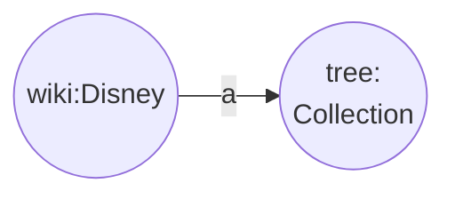
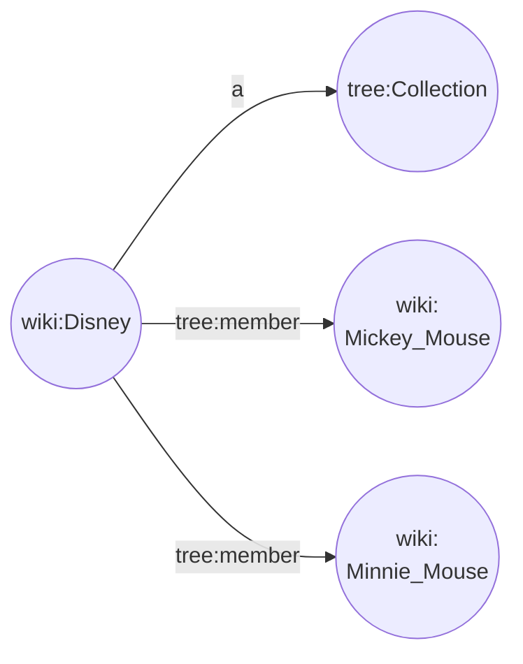

The TREE specification defines a `tree:Collection`, which is basically a data set of _members_, which are the data items. Therefore, each data item is a thing which is the object in a relation named `tree:member`.

The most simple collection possible is one without members. Not very useful but it is a start:
```
@prefix tree: <https://w3id.org/tree#> .
@prefix wiki: <http://en.wikipedia.org/wiki/> .
wiki:disney a tree:Collection .
```


Fig 1. Example of a TREE collection without members.

It gets a bit more interesting if we add some data items. Here is the same TREE collection with two members:

```
@prefix tree: <https://w3id.org/tree#> .
@prefix wiki: <http://en.wikipedia.org/wiki/> .
wiki:disney a tree:Collection ;
    tree:member wiki:Mickey_Mouse, wiki:Minnie_Mouse .
```

or visually:


Fig 2. Example of a TREE collection with members.

This is a bit better as we now know the members of this collection, but we still need to add the member definitions:
```
@prefix tree: <https://w3id.org/tree#> .
@prefix wiki: <http://en.wikipedia.org/wiki/> .
@prefix schema: <http://schema.org/> .
wiki:disney a tree:Collection ;
    tree:member wiki:Mickey_Mouse, wiki:Minnie_Mouse .
wiki:Mickey_Mouse 
    a schema:Person ;
    schema:gender "male" ;
    schema:owns [ a schema:Product ; schema:category "shoes" ; schema:color "yellow" ] .
wiki:Minnie_Mouse 
    a schema:Person .
```

OK, that looks good except for the fact that our members have a different number of properties. This may be just fine, but how does a data client know that? How can a data client know that each member's model is completely defined and that we did not forget a part by accident? We need a mechanism to ensure that all data items have the same number and type of (mandatory and optional) predicates. In addition, we want to communicate to the data client what a data item looks like.

The TREE specification defines a `tree:shape` predicate on the `tree:Collection`. This allows us to add a so-called [SHACL](https://w3c.github.io/data-shapes/shacl/) shape, which defines some rules to indicate what predicates a model can or must contain, what type is acceptable for a predicate and how many occurrences a predicate can have. We can use a SHACL shape validator to validate that a model conforms to those rules.

Explaining SHACL will take us too far but here is an example to give you an idea what it looks like.

```
@prefix schema: <http://schema.org/> .
@prefix sh: <http://www.w3.org/ns/shacl#> .
@prefix xsd: <http://www.w3.org/2001/XMLSchema#> .

schema:PersonShape
    a sh:NodeShape ;
    sh:targetClass schema:Person ;
    sh:property [
        sh:path schema:givenName ;
        sh:datatype xsd:string ;
        sh:name "given name" ;
        sh:minCount 1 ;
        sh:maxCount 1 ;
    ] ;
    sh:property [
        sh:path schema:birthDate ;
        sh:lessThan schema:deathDate ;
        sh:maxCount 1 ;
    ] ;
    sh:property [
        sh:path schema:gender ;
        sh:in ( "female" "male" ) ;
    ] ;
    sh:property [
        sh:path schema:owns ;
        sh:node schema:ProductShape ;
    ] .

schema:ProductShape
    a sh:NodeShape ;
    sh:property [
        sh:path schema:category ;
        sh:datatype xsd:string ;
    ] ;
    sh:property [
        sh:path schema:color ;
        sh:datatype xsd:string ;
    ]  .
```
**Note** that we simply write the SHACL rules as RDF.

**Note** that our members would violate this SHACL shape because it specifies that the predicate `schema:givenName` MUST be present exactly once.

The [TREE vocabulary](https://cdn.jsdelivr.net/gh/treecg/specification@master/tree.ttl) formally defines all the concepts in detail.

Summarized, in TREE we define a **data set as a `tree:Collection`** with its predicate **`tree:member` referring to a data item** and we use the **`tree:shape` predicate to define the data item validation rules** that each data item must obey.
