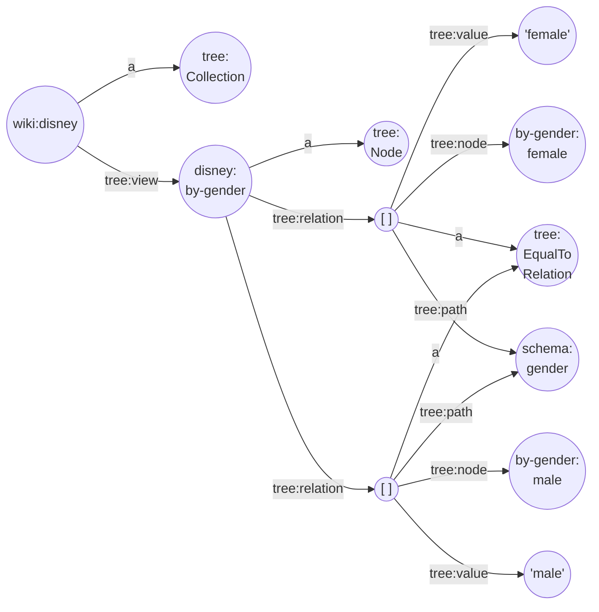

Although a geo-spatial view is very precise and allows us to retrieve a subset by means of a few bounding boxes, it is non-trivial to calculate these square polygons. Instead, we can use the `tree:EqualToRelation` to create a view based on string, or even better, URI equality.

If our member models are [labelled](https://www.w3.org/TR/rdf-schema/#ch_label) or classified in another way using a (limited set of) string or URI value (e.g. "Brugge", "Gent", \<http://www.brugge.be/\>, \<http://stad.gent\> ...), we can create the buckets labelled 'equal to "Brugge"', 'equal to \<http://stad.gent\>', etc. This allows us to partition our data set using any arbitrary classification.

Example reference-based view:
```
@prefix tree:      <https://w3id.org/tree#> .
@prefix sh:        <http://www.w3.org/ns/shacl#> .
@prefix schema:    <http://schema.org/> .
@prefix dct:       <http://purl.org/dc/terms/> .
@prefix xsd:       <http://www.w3.org/2001/XMLSchema#> .
@prefix wiki:      <http://en.wikipedia.org/wiki/> .
@prefix disney:    <http://en.wikipedia.org/wiki/disney/> .
@prefix by-gender: <http://en.wikipedia.org/wiki/disney/by-gender/> .

wiki:disney a tree:Collection ;
  tree:view disney:by-gender .

disney:by-gender a tree:Node ;
  tree:relation [ 
      a tree:EqualToRelation ; 
      tree:path schema:gender ; 
      tree:value "female" ; 
      tree:node by-gender:female 
  ] , [ 
      a tree:EqualToRelation ; 
      tree:path schema:gender ; 
      tree:value "male" ; 
      tree:node by-gender:male 
  ] .
```


Fig 1. Example Reference-based View
