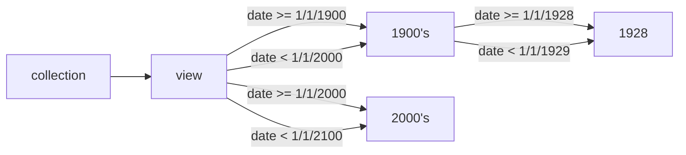

We can create a view that allows filtering our members on time (_historical filtering_) if we use a timestamp property of our members for the relation's `tree:path`.

We can create a structure where the collection view contains relations to a year value to do a first rough partitioning of our data members. Each year node can then be subdivided into its month values and further down to any required level by linking to day nodes, hour nodes, etc.

Node `disney:by-time` (the time-based view):
```
@prefix tree: <https://w3id.org/tree#> .
@prefix wiki: <http://en.wikipedia.org/wiki/> .
@prefix schema: <http://schema.org/> .
@prefix xsd: <http://www.w3.org/2001/XMLSchema#> .
@prefix disney: <http://en.wikipedia.org/wiki/disney#> .
wiki:disney a tree:Collection ;
  tree:view disney:by-time .
disney:by-time a tree:Node ;
  tree:relation
      [ a tree:GreaterThanOrEqualRelation; tree:node disney:1900 ;
          tree:path schema:birthDate ; tree:value "1900-01-01"^^xsd:date ] , 
      [ a tree:LessThanRelation; tree:node disney:1900 ;
          tree:path schema:birthDate ; tree:value "2000-01-01"^^xsd:date ] ,
      [ a tree:GreaterThanOrEqualRelation; tree:node disney:2000 ;
          tree:path schema:birthDate ; tree:value "2000-01-01"^^xsd:date ] ,
      [ a tree:LessThanRelation; tree:node disney:2000 ;
          tree:path schema:birthDate ; tree:value "2100-01-01"^^xsd:date ] .
```
Node `disney:1900` (all Disney figures 'born' in the previous century):
```
@prefix tree: <https://w3id.org/tree#> .
@prefix wiki: <http://en.wikipedia.org/wiki/> .
@prefix schema: <http://schema.org/> .
@prefix void: <http://rdfs.org/ns/void#> .
@prefix xsd: <http://www.w3.org/2001/XMLSchema#> .
@prefix disney: <http://en.wikipedia.org/wiki/disney#> .
wiki:disney a tree:Collection ;
  void:subset disney:1900 .
disney:1900 a tree:Node ;
  tree:relation
      [ a tree:GreaterThanOrEqualRelation; tree:node disney:1928 ;
          tree:path schema:birthDate ; tree:value "1928-01-01"^^xsd:date ] , 
      [ a tree:LessThanRelation; tree:node disney:1928 ;
          tree:path schema:birthDate ; tree:value "1929-01-01"^^xsd:date ] .
```
Node `disney:1928` (all Disney figures 'born' in 1928):
```
@prefix tree: <https://w3id.org/tree#> .
@prefix wiki: <http://en.wikipedia.org/wiki/> .
@prefix schema: <http://schema.org/> .
@prefix void: <http://rdfs.org/ns/void#> .
@prefix xsd: <http://www.w3.org/2001/XMLSchema#> .
@prefix disney: <http://en.wikipedia.org/wiki/disney#> .
wiki:disney a tree:Collection ;
  void:subset disney:1928 ;
  tree:member wiki:Mickey_Mouse, wiki:Minnie_Mouse .
disney:1928 a tree:Node  .
wiki:Mickey_Mouse a schema:Person ; schema:birthDate "1928-11-18"^^xsd:date.
wiki:Minnie_Mouse a schema:Person ; schema:birthDate "1928-11-18"^^xsd:date .
```


Fig 1. Example of time-based structure

> **Note** that in this example we create a time-based view starting from a century and then by year. We could also create buckets for each decade, e.g. 1920-1930, 1930-1940, etc., or even buckets of non-equal size, e.g. 1950-1970, 1970-2000. Because we specify the boundaries explicitly a data client can determine the exact buckets that are needed.

Summarized, a **time-based view** allows us to create a **hierarchical structure** where we can **filter a data set based on a time interval**.